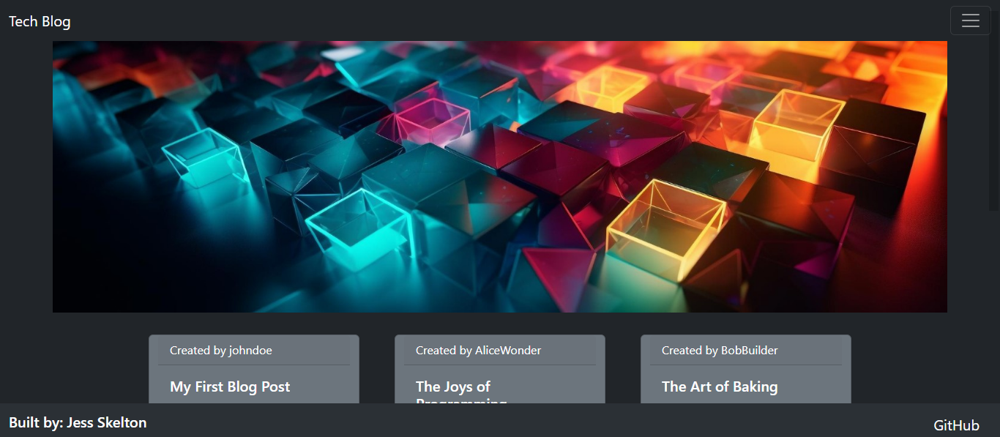

# tech-blog

## Description
Challenge 14 -- Model-View-Controller (MVC) Challenge: Tech Blog

This project was designed for developers passionate about technology, my CMS-style blog site offers a comprehensive platform for publishing articles, blog posts, and personal opinions. 

Upon visiting, users are greeted with a homepage that showcases existing blog posts, alongside intuitive navigation links to the homepage, dashboard, and a login option. Registration is straightforward, prompting new users to create a username and password, ensuring a seamless transition into being logged into the site. For returning users, a simple login process awaits. Once logged in, users can effortlessly navigate between the homepage, dashboard, and logout options. The homepage presents blog posts with titles and creation dates, while the dashboard offers a personal space for users to manage their posts, including options to add new entries. Engaging with the community is encouraged through commenting features on each post. Enhanced user experience is ensured through features like automatic logout after a period of inactivity, prompting users to log in again to add, update, or delete content, ensuring both security and user engagement.

## Table of Contents

- [Installation](#installation)
- [Usage](#usage)
- [Credits](#credits)
- [License](#license)
- [Badges](#badges)
- [Features](#features)
- [Tests](#tests)
- [Questions](#questions)

## Installation

If just visiting the site, please see the deployed application link in the [Usage](#usage) section, and then use as desired. 

In order to test the program, please use `npm i` in order to install the required dependiencies listed in the package.json, source the database (mysql log in, `source ./db/schema.sql`), seed the database (`npm run seed`), and then `npm run start` to start a local server version. Please also update the .env.EXAMPLE file with your own credentials for MySQL and rename the file to just .env so that it will be ignored in any git push.

## Usage

To visit the deployed application, use the following link:
https://tech-blog-ch-fce07de2de9a.herokuapp.com/
Please revisit the [Description](#description) section to review application specific features.

Screenshot of deployed application:

## Credits

I recieved some help from my tutor, Bobbi Tarkany, whom assisted in the debugging of the back end. Please check out her work by visiting her [GitHub](https://github.com/bltarkany).

Hero/Banner Photo used from free-to-use photo library site:
@vecstock. (n.d.). Freepik. Designed by Freepik. Retrieved from https://www.freepik.com/free-ai-image/glowing-geometric-shapes-vibrant-colors-ly-reflect-generated-by-ai_42884570.htm#query=coding&position=35&from_view=search&track=sph&uuid=80981692-6912-4950-afa4-1dad6cd27bab. 

## License

[MIT License](https://opensource.org/licenses/MIT)

## Badges

## Features

For application-specific features, please revisit the [Description](#description) section

* CSS & Bootstrap
* Handlebars
* JavaScript & JSON
* Express 
* Express-Handlebars
* Express-Session
* Node
* MySQL
* Sequilize
* DotEnv

## Tests

You can test this back end project by using the program Insomnia & hosting a local server so that you can interact with the database thru Sequelize. I have provided necessary installation instructions for testing inside the previous [Installation](#installation) section. 

## Questions

If you have any questions, feel free to reach out to me via [GitHub](https://github.com/jskelly8/) or email me at jessskelton888@gmail.com.
